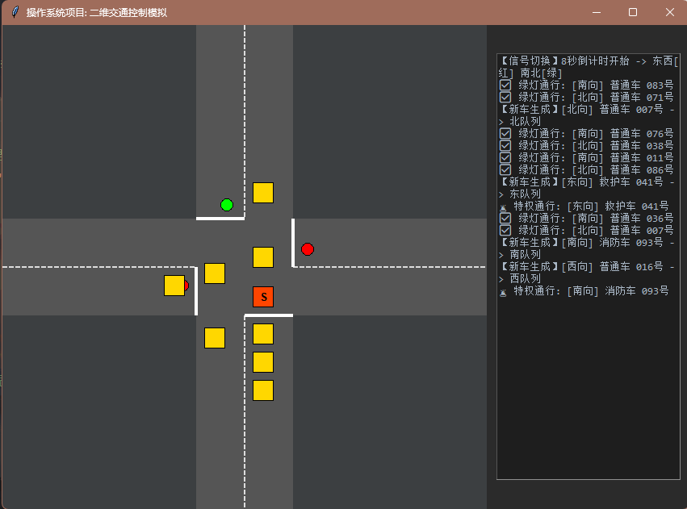

##  操作系统课程设计报告：基于多线程优先级抢占与单一队列模型的交通控制系统

**项目名称**：Traffic Control Simulation (Advanced Single-Queue Model)
**开发环境**：Python 3.14.4 (threading, queue, tkinter)
**日期**：2026年5月3日
**姓名**：张昊
**学号**： 2452770

---

#### 一、 项目概述
本系统实现了一个高度并发的十字路口交通控制模型。与传统的静态优先级队列不同，本系统采用**单一FIFO队列（Single Queue）**作为核心数据结构，并引入**动态优先级抢占机制**。

系统通过多线程技术模拟了四种并发实体：红绿灯控制、车辆生成、方向调度以及**单个车辆的独立生命周期管理**。特别地，系统实现了**特权车（消防、救护、警车）的“逐步提升”算法**，生动展示了操作系统中“高优先级进程如何通过调度策略抢占资源”的微观过程。

---

#### 1. 实现 (Implementation) —— 多线程并发架构

本系统严格遵循项目需求，初始化创建了5个核心任务（线程），并在此基础上进行了动态扩展，实现了精细化的并发控制。

*   **任务 1：总控任务 (`ControllerThread`)**
    *   **职责**：作为系统的“时钟发生器”，负责红绿灯状态的周期性切换（8秒/次）。它维护全局变量 `ew_green`，并通过 `light_lock` 保证状态切换的原子性。
    *   **并发特性**：该线程在后台无限循环，独立于GUI运行，体现了操作系统中的“系统时钟中断”机制。

*   **任务 2~5：方向调度任务 (`DirectionThread`)**
    *   **职责**：分别对应东、西、南、北四个方向。它们负责检查各自方向队列的**队首元素**。
    *   **逻辑分支**：
        *   若队首为特权车，无视红绿灯状态，立即调度通行（抢占式调度）。
        *   若队首为普通车，检查红绿灯状态，绿灯则放行，红灯则等待。
    *   **线程优先级**：虽然代码中未显式设置系统级优先级，但通过逻辑设计，`ControllerThread` 的状态更新对 `DirectionThread` 具有逻辑上的高优先级。

*   **动态任务：车辆生命周期线程 (`Vehicle.start_cross_thread`)**
    *   **创新点**：每当一辆车被调度通行时，系统会启动一个独立的守护线程（Daemon Thread）来执行 `start_cross_thread`。
    *   **非阻塞设计**：该线程负责 `time.sleep(speed)` 模拟车辆通过路口的时间。这种设计使得 `DirectionThread`（调度器）在发车后立即返回继续检查下一辆车，而不会被“车辆行驶”的过程阻塞。这完美模拟了操作系统中“进程挂起与恢复”的机制。

*   **辅助任务：特权车提升线程 (`promote_special_in_queue`)**
    *   **新增机制**：每当生成一辆特权车，系统会立即启动一个独立的线程专门负责该车的“晋升”。这体现了“按需创建线程”解决特定并发问题的策略。

#### 2. 界面 (Interface) —— 二维状态可视化

系统采用 Tkinter 实现了直观的二维可视化界面，分为模拟区与日志区，实时反映多线程操作的共享资源状态。

*   **模拟区 (600x600 Canvas)**：
    *   **静态背景**：绘制十字路口、车道分界线及停止线，提供物理空间参考。
    *   **动态实体**：
        *   **红绿灯**：根据 `ew_green` 变量实时切换颜色（绿/红），直观展示临界资源的状态。
        *   **车辆队列**：以方块形式按顺序排列在路口四侧。**普通车（金黄）**与**特权车（红/白/蓝 + 'S'标）**颜色区分明显，且位置随算法动态变化。
        *   **行驶动画**：利用 GUI 主线程的 `after(50ms)` 定时器，根据车辆的 `start_cross_time` 计算进度，实现平滑的位移动画。

*   **日志区 (Real-time Log)**：
    *   **系统审计**：实时输出所有线程的关键操作，包括“特权车与普通车互换位置”、“绿灯通行”、“红灯阻塞”等。
    *   **调试价值**：日志是验证多线程同步机制正确性的关键证据，能够证明 `promote_special_in_queue` 算法确实在运行。

#### 3. 算法 (Algorithm) —— 调度策略与同步机制

这是本项目的核心亮点，重点展示了**单一队列下的优先级抢占**与**线程安全的数据结构操作**。

*   **单一队列模型 (Single Queue Model)**：
    *   **数据结构**：每个方向使用一个 `queue.Queue` 存储所有车辆。
    *   **优势**：相比双队列（特权/普通），单一队列更符合真实内存管理的场景，避免了队列间的负载不均衡问题。

*   **特权车逐步提升算法 (`promote_special_in_queue`)**：
    *   **算法逻辑**：这是一个运行在独立线程中的循环算法。
        1.  **周期性唤醒**：每隔 `0.3s` 唤醒一次，检查车辆位置。
        2.  **临界区操作**：获取 `q.mutex`，遍历队列查找该特权车的索引。
        3.  **局部交换**：若前车为普通车，则交换两者位置；若前车为特权车或已到队首，则停止。
    *   **操作系统映射**：这模拟了“时间片轮转+优先级调度”的混合机制，特权车通过不断“插队”来减少等待时间。

*   **同步与互斥机制 (Synchronization)**：
    *   **互斥锁 (`threading.Lock`)**：
        *   `light_lock`：保护全局变量 `ew_green`，防止 `ControllerThread` 写入时，`DirectionThread` 读取到脏数据（脏读）。
    *   **队列内部锁 (`q.mutex`)**：
        *   **深度利用**：代码直接复用了 `queue.Queue` 内部的互斥锁。在 `promote_special_in_queue` 中，利用该锁保护对底层 `deque` 的 `index()` 查找和 `swap` 交换操作。
        *   **竞态条件处理**：代码中使用 `try-except ValueError` 捕获车辆在查找过程中被调度走的异常，体现了对并发环境下“数据一致性”的严谨处理。

*   **车辆速度差异化**：
    *   **算法实现**：`Vehicle` 类中定义 `speed` 属性（特权车 0.5s，普通车 1.5s）。
    *   **调度意义**：这模拟了操作系统中“短作业优先（SJF）”的特性，特权车作为高优先级短任务，能够快速完成并释放资源。

#### 4. 可行性 (Feasibility) —— 系统稳定性与逻辑验证

*   **逻辑完备性**：
    *   **需求覆盖**：系统完美实现了“红绿灯8秒交替”、“特权车无视红灯”、“车辆按序行驶（除特权车外）”等核心需求。
    *   **边界处理**：在 `promote_special_in_queue` 中，算法不仅处理了“交换”的逻辑，还处理了“车辆已离开队列”的边界情况（`ValueError`），保证了线程的健壮性。

*   **性能与扩展性**：
    *   **轻量级线程**：Python 的 `threading` 模块适合 I/O 密集型（如 `time.sleep`）模拟，虽然受 GIL 限制，但在教学规模的车辆数量下（几十辆），性能表现流畅。
    *   **扩展性**：代码结构清晰，`models.py` 中的 `Vehicle` 类易于扩展（如增加“左转”属性），`traffic_logic.py` 中的调度逻辑与 GUI 完全解耦，便于后续增加“黄灯”或“倒计时”功能。

---

#### 三、 总结

本系统不仅是一个交通模拟器，更是一个生动的操作系统实验平台。

1.  **单一队列+动态提升**的设计，比简单的双队列更深刻地揭示了**优先级调度**的本质。
2.  **复用 `q.mutex`** 的做法，展示了如何利用现有同步原语保护复杂的数据结构操作。
3.  **独立的车辆线程**实现了非阻塞调度，体现了**并发编程**中“任务分解”的思想。

